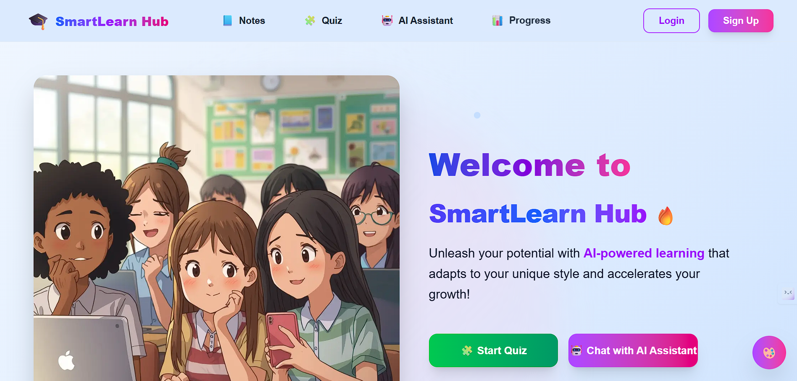
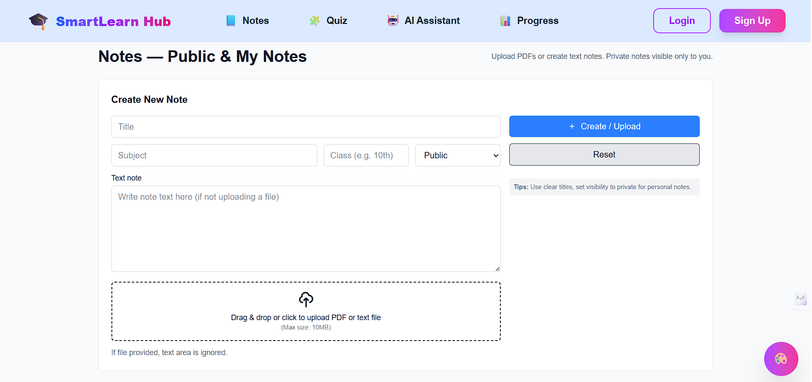
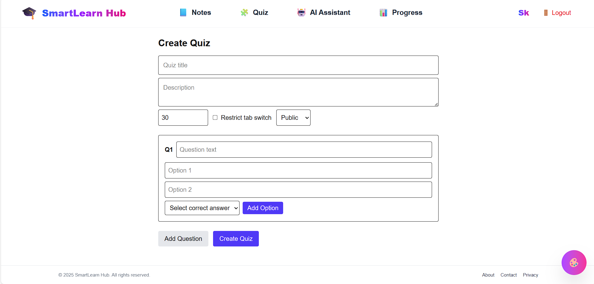
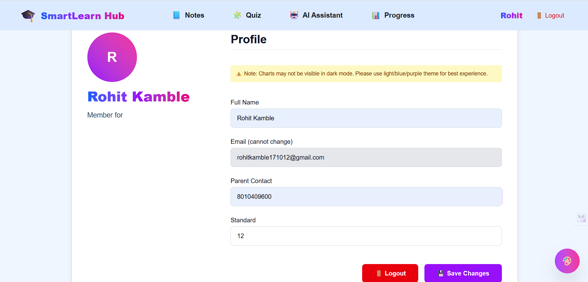
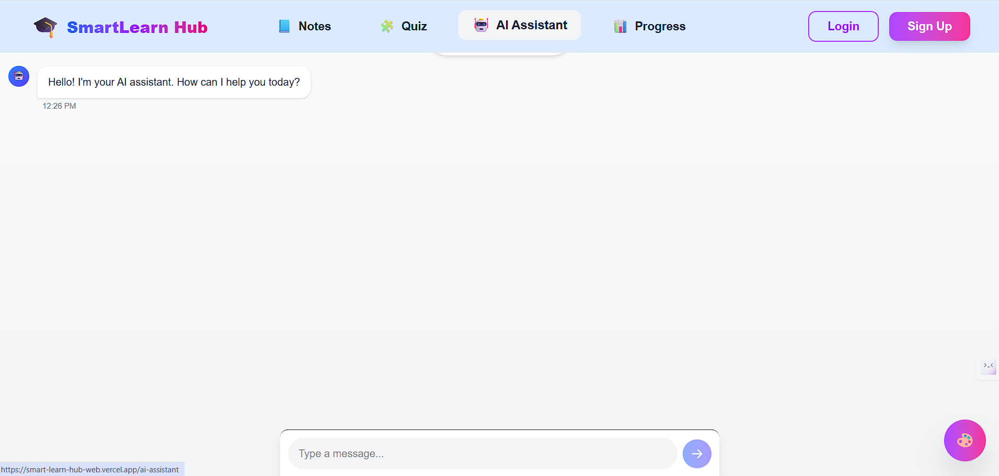

🎓 SmartLearn Hub

SmartLearn Hub is a modern *e-learning platform* built with *Next.js (frontend)* and *Node.js/Express (backend)*.  
It empowers *students and teachers* with interactive quizzes, AI assistance, progress tracking, and collaborative notes sharing.

---

## ✨ Features

### 👩‍🎓 For Students
- Take *Quizzes* created by teachers  
- Track *Progress* with scores, averages, and streaks  
- Access *Notes* shared by peers and teachers  
- Use *AI Assistant* (Gemini API) for study help  
- Personalized *Profile Page*

### 👨‍🏫 For Teachers
- Create and manage *Quizzes*  
- View *Quiz Results* of students  
- Upload & share *Study Notes*  
- Track *student engagement*  

---

## 🖼 Screenshots


### 🏠 Home / Navbar


### 📝 Notes Section


### 🧩 Quiz Section


### 📊 Progress Tracking


### 👤 Profile


### 🤖 AI Assistant


---

## 🛠 Tech Stack

### Frontend
- ⚡ [Next.js 15](https://nextjs.org/)  
- 🎨 [TailwindCSS](https://tailwindcss.com/) + Dark/Light Themes  
- ✨ [Framer Motion](https://www.framer.com/motion/) animations  
- 🔑 Firebase Authentication (Email & Password)  

### Backend
- 🚀 [Node.js](https://nodejs.org/) + [Express](https://expressjs.com/)  
- 🗄 [MongoDB](https://www.mongodb.com/) with Mongoose  
- 🔑 JWT Authentication with Firebase tokens  
- 🤖 [Google Gemini API](https://ai.google.dev/) for AI Assistant  
- 📦 RESTful APIs (/auth, /quiz, /notes, /progress, /ai)  

### Deployment
- 🌐 Frontend → [Vercel](https://vercel.com/)  
- 🔥 Backend → [Render](https://render.com/)  

---

## ⚙ Installation & Setup (Local)

### 1️⃣ Clone the repository
```bash
git clone https://github.com/your-username/SmartLearnHub_WEB.git
cd SmartLearnHub_WEB
